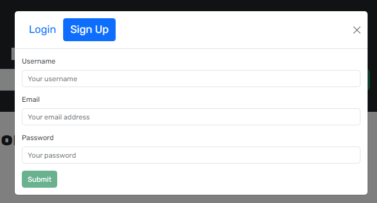
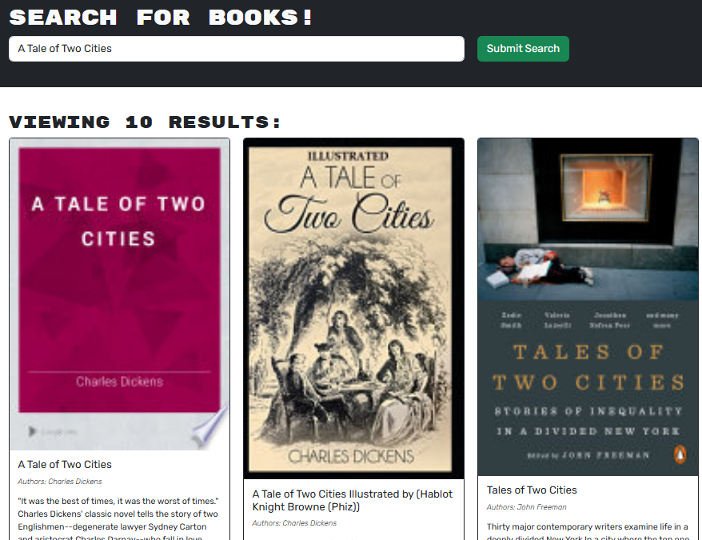
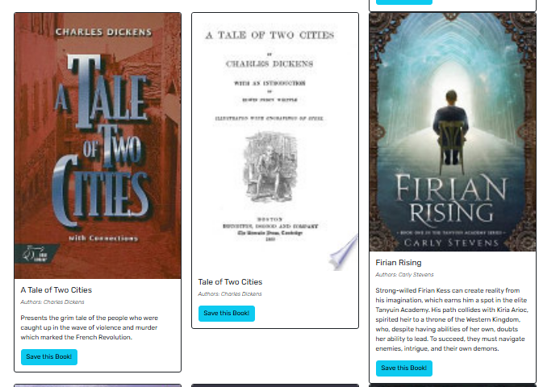
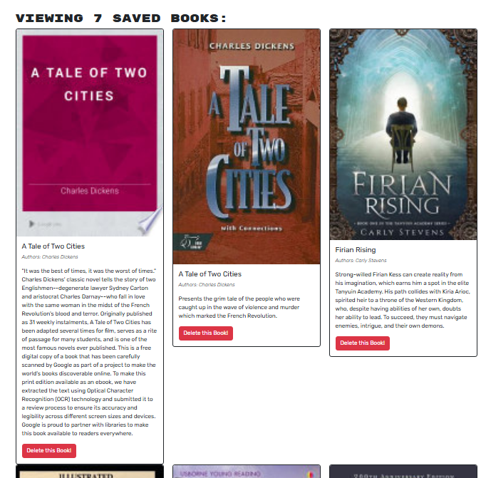

# 📚 Book Search Engine  

## **📖 Description**  
The **Book Search Engine** is a web application that allows users to **search for books** using the [Google Books API](https://developers.google.com/books) and **save books** for later review. The app is built using **MongoDB (via Atlas) and GraphQL** for efficient data management.  

---

## **🚀 Deployed Application**  
🔗 [Book Search Engine on Render](https://book-search-engine-1oiu.onrender.com/)  

---

## **🛠 Features**  

✅ **User Authentication** – Create an account or log in using your email & password.  
✅ **Book Search** – Search for books using the input field.  
✅ **Save Books** – Save books to your personal list for future reference.  
✅ **View Saved Books** – Access your saved books anytime.  
✅ **Delete Books** – Remove books from your saved list when no longer needed.  

---

## **⚡ Usage**  

### **🔑 Login Page**  
Create a new account or log in with an existing one.  

  

### **🔍 Book Search**  
Find books by entering a search term and clicking **"Submit Search"**.  

  

### **📌 Save Books**  
Click **"Save this Book"** to add books to your saved list.  

  

### **🗑️ Manage Saved Books**  
View and manage your saved books by clicking **"See Your Books"** in the top navigation.  
Click **"Delete this Book"** to remove a book from your list.  

  

---

## **📝 Technologies Used**  
- **Frontend:** React, Bootstrap  
- **Backend:** Node.js, Express  
- **Database:** MongoDB (Atlas)  
- **API:** Google Books API  
- **GraphQL:** Apollo Server & Client  

---

## **❓ Questions & Contact**  
📌 **GitHub:** [cablej02](https://github.com/cablej02)  
📧 **Email:** [cablej02@gmail.com](mailto:cablej02@gmail.com)  

If you have any questions or feedback, feel free to reach out!
